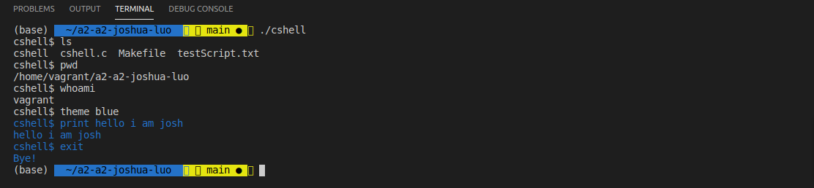
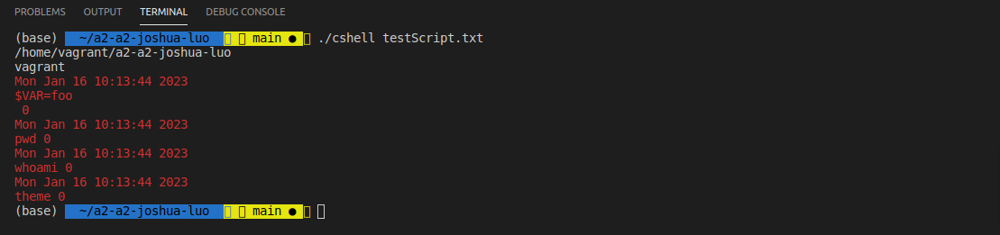

# Cshell 
> Custom shell for Linux

## General Information

- This is a simple custom shell that adds some new features
- Made for CMPT 300 Assignment

## Features
- cshell recognizes the following lines:
It recognizes lines of the form $<VAR>=<value>
It recognizes lines of the form <command> <arg0> <arg1> … <argN>, where <command> is a name of built-in command.

- cshell will also support the following built-in commands:
exit, the shell terminates on this Command. This must be implemented for a clean exit of the program.   
log, the shell prints history of executed commands with time and return code
print, the shell prints argument given to this Command
theme, the shell changes the color of and output

- When cshell takes a non-built-in command (like ls, pwd, whoami), it is executed in the child process, and Command's output is printed. 
cshell creates a child process using fork() system call, then cshell waits for the child process to terminate via wait() system call. 
Child process executes a non-built-in command using exec() and its analogues. 

- Two modes
Our cshell will work in two modes: interactive mode and script mode. 

- The interactive mode is activated when cshell starts without command line arguments.

- Interactive mode is essentially the following loop:
Print out a prompt
Read line
Parse line, and if the line is non-valid, print an error message
If the line was valid, do what should be done.

- Script mode
For script mode, it should start like ./cshell <filename> 

- The script is a file containing a set of lines e.g.
<command1> <arg0> <arg1> … <argN>
$VAR1=<value1>
…..
<commandK> <arg0> <arg1> … <argN>
…..
In script mode, the shell does the following for each line of the file:
Read the line of the file
Parse line, if the line is non-valid, print an error message
If the line was valid, do what should be done.
The program must exit cleanly after executing in script mode.

- Environment variables
The shell will support the inner environment variables

- When cshell takes a line of the form $<VAR>=<value>, it should allocate a new EnvVar struct with name=<VAR> and value=<value>. 
All environment variables could be stored in some array. 
EnvVar's name should be unique. If a variable already exists, its value should be updated.

- If some argument takes the form $<VAR>, cshell should look up stored environment variables,find the one with name=<VAR> and substitute argument with environment variable's value. If the corresponding variable does not exist, an error message must be printed. 
A command starting with $var should be immediately followed by =value. (Note: no spaces before and after =)

- Parsing of lines of the form $<VAR>=<value> should be simple given that it starts with $ symbol and variable name and value separated by = sign. Parsing of lines of the form <command> <arg0> <arg1> … <argN> gets a little more complicated, shell should check if <arg> starts with $ symbol.

## Screenshots

## Usage
Use Makefile to compile the code, then run the compiled program

## Contact
Created by [@JoshuaLuo](https://github.com/Joshua-z-Luo) - feel free to contact me at jla818@sfu.ca

